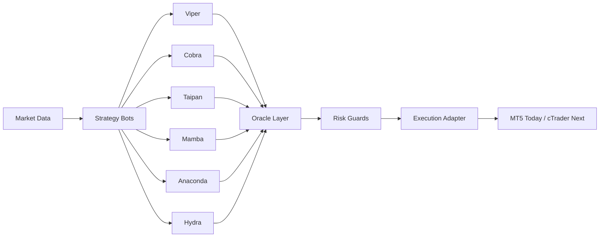

<div align="center">

# Glitch Trading Core

Core Glitch trading bots, oracle coordination, and shared risk infrastructure for a multi-strategy trading stack.


[](https://github.com/glitch-executor/glitch-trading-core)
[](https://github.com/glitch-executor/glitch-ouroboros-snake-strategy)
[](https://github.com/glitch-executor/glitch-indian-king-cobra)
[](https://github.com/glitch-executor/glitch-terciopelo)

</div>

> Glitch Trading Core is the reference strategy repository for the Glitch stack: multiple specialized bots, shared feature engineering, centralized risk controls, and an Oracle layer that coordinates decisions across the ensemble.

## Repo Role

Glitch Trading Core is the ecosystem hub.

It provides:

- the umbrella engineering repo for the Glitch family
- shared architecture, documentation, and platform direction
- the bridge between the current MT5 estate and the next cTrader deployment

## Naming Hierarchy

The Glitch ecosystem is organized in three layers:

- **Glitch Trading Core**: the umbrella engineering and architecture repository
- [**Ouroboros Snake Strategy**](https://github.com/glitch-executor/glitch-ouroboros-snake-strategy): the flagship multi-bot ensemble strategy
- **Satellite strategy repos**: standalone strategy products such as Indian King Cobra and Terciopelo

## Ecosystem Links

- [Glitch Trading Core](https://github.com/glitch-executor/glitch-trading-core) is the umbrella repo
- [Ouroboros Snake Strategy](https://github.com/glitch-executor/glitch-ouroboros-snake-strategy) is the flagship Oracle-plus-six-snake ensemble
- [Indian King Cobra](https://github.com/glitch-executor/glitch-indian-king-cobra) is the standalone unified momentum scalper
- [Terciopelo](https://github.com/glitch-executor/glitch-terciopelo) is the standalone equities relative-value strategy

### Ouroboros Snake Strategy

Ouroboros Snake Strategy is the flagship coordinated ensemble inside the Glitch system.

It combines:

- the Oracle coordination layer
- the six-snake execution stack of Viper, Cobra, Taipan, Mamba, Anaconda, and Hydra
- shared risk controls, feature engineering, and broker-adapter design

Indian King Cobra and Terciopelo should be positioned as separate strategy products rather than folded permanently into the Ouroboros ensemble identity.

## Broker And Platform Reach

The Glitch ecosystem is intentionally bigger than one broker or one execution venue.

Across the broader strategy family, the codebase history already spans:

- MT5-based execution
- Interactive Brokers-based execution
- Kraken API-based execution
- cTrader as the next platform target

That matters because the long-term design goal is not broker lock-in. It is portable strategy logic with swappable execution adapters.

## Why This Repo Exists

This repository is designed to do two jobs well:

- preserve the current MT5 implementation of the Glitch bot family
- define a clean migration path toward a cTrader-native Linux deployment

The strategy concepts stay the same across both platforms:

- multi-bot specialization instead of one monolithic strategy
- portfolio-aware risk and conflict management
- prop-firm-style protection rules
- reusable indicator, feature, and orchestration modules

## System At A Glance



## Strategy Stack

| Bot | Style | Primary TF | Core Role | Typical Use |
| --- | --- | --- | --- | --- |
| `viper.py` | momentum + pullback | M5 | fast execution | intraday trend continuation |
| `cobra.py` | support/resistance price action | H1 | discretionary-style structure logic | higher-conviction reversal or continuation |
| `taipan.py` | session breakout | M30 | session expansion capture | prop-style directional breakouts |
| `mamba.py` | Bollinger mean reversion | M15 | range trading | controlled fade setups |
| `anaconda.py` | breakout confirmation | H4 | swing confirmation | slower high-structure entries |
| `hydra.py` | regime routing | M1 | adaptive execution | trend/range switching logic |
| `oracle.py` | coordination engine | multi-bot | consensus and conflict control | portfolio-level decision shaping |

More detail lives in [docs/strategy-matrix.md](./docs/strategy-matrix.md).

## Satellite Strategy Repos

These now live as standalone public repos rather than as part of the core codebase:

- [glitch-indian-king-cobra](https://github.com/glitch-executor/glitch-indian-king-cobra)
- [glitch-terciopelo](https://github.com/glitch-executor/glitch-terciopelo)

Glitch Trading Core should describe and link these products, but not present them as part of the in-repo Ouroboros execution stack.

## Repository Map

```text
glitch-trading-core/
|-- mt5/
|   |-- bots/        Current Python bot entrypoints
|   |-- shared/      Indicators, risk, data, orchestration
|   `-- configs/     Sanitized example configs only
|-- ctrader/
|   `-- README.md    Migration target and platform design notes
`-- docs/
    |-- architecture.md
    |-- platform-map.md
    |-- roadmap.md
    `-- strategy-matrix.md
```

## Current Platform Direction

### MT5 Track

- current reference implementation
- existing bot logic and orchestration live here
- shared Python modules are already organized for reuse

### cTrader Track

- target production deployment path
- same signal concepts, cleaner platform adapter
- Linux-friendly runtime model

Read the cTrader direction in [ctrader/README.md](./ctrader/README.md).

## Engineering Principles

- strategy logic should be separable from broker APIs
- the Oracle should consume normalized intents, not platform-specific payloads
- risk controls should be reusable across execution venues
- configs in Git should be sanitized templates, never live credentials
- training data and models should live outside the public source repo

## Quick Start

1. Review the strategy layout in [docs/strategy-matrix.md](./docs/strategy-matrix.md).
2. Inspect the current execution bots in [`mt5/bots/`](./mt5/bots).
3. Use the templates in [`mt5/configs/`](./mt5/configs) for local configuration.
4. Keep secrets, state, model artifacts, and training data outside version control.
5. Use this repo as the source-of-truth for strategy and platform structure, not for live credentials or production state.

## Documentation

- [Architecture](./docs/architecture.md)
- [Ouroboros Snake Strategy](./docs/ouroboros-snake-strategy.md)
- [Platform Map](./docs/platform-map.md)
- [Repo Ecosystem](./docs/repo-ecosystem.md)
- [Strategy Matrix](./docs/strategy-matrix.md)
- [Roadmap](./docs/roadmap.md)
- [cTrader Track](./ctrader/README.md)

## License And Attribution

This project is released under the [Apache License 2.0](./LICENSE).

That means other builders can use, modify, and distribute the code, while the
project still keeps a clear authorship trail through:

- [NOTICE](./NOTICE)
- [AUTHORS.md](./AUTHORS.md)

## Branding Note

`Glitch` and `Glitch Executor` are part of the original project identity and
branding. The code is open under Apache 2.0, but the license does not grant
trademark rights beyond normal attribution and origin references.

## Safety Notes

- only sanitized example configs are included
- no state files, broker credentials, secrets, models, or training data are committed
- MT5 config files in this repo are templates, not live deployment artifacts
- public repository hygiene matters because the strategy and infrastructure will evolve across environments
