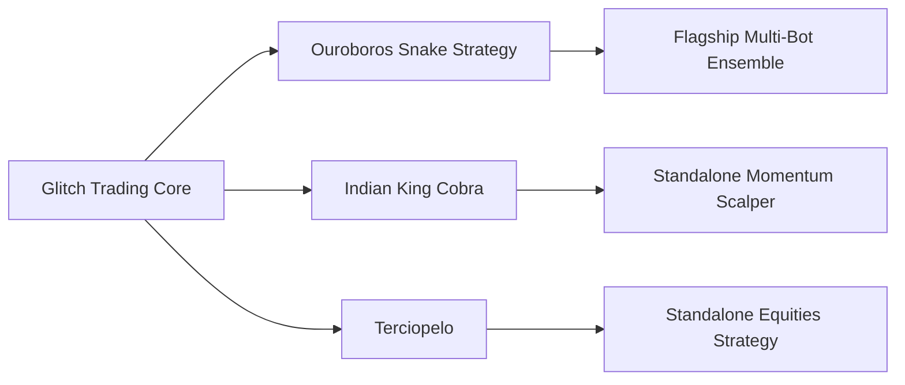
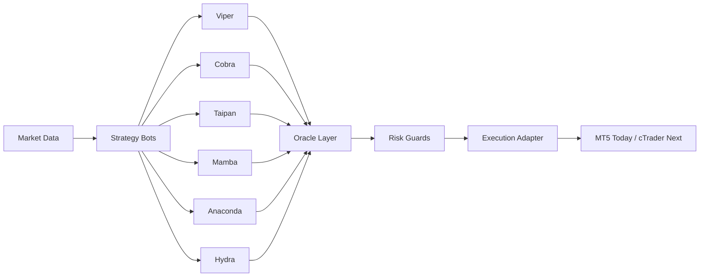

<div align="center">

# Glitch Trade Core

Core strategy architecture, Oracle coordination, and shared risk infrastructure for the **Glitch Trade** stack.


[Ouroboros Snake Strategy](https://github.com/glitch-exec-labs/glitch-trade-ouroboros-snake-strategy) · Indian King Cobra _(private)_ · Terciopelo _(private)_

</div>

> Part of **Glitch Trade**, the trading domain inside **Glitch Executor Labs** — one builder shipping products across **Trade**, **Edge**, and **Grow**.

> Glitch Trading Core is the umbrella architecture repo for the Glitch trading family: shared modules, Oracle coordination patterns, centralized risk design, and the bridge from today's MT5 estate to the next cTrader stack.

---

## 💼 Fine-tuned models + backtested bots — available on request

The `trade-core` architecture and the live **[Ouroboros](https://github.com/glitch-exec-labs/glitch-trade-ouroboros-snake-strategy)** strategy are public. What sits behind them is not:

- **Indian King Cobra**, **Terciopelo**, and several other earlier standalone bots ran in early production and are **disabled today** — only Ouroboros is live.
- **Backtest archives, fine-tuned model weights, labeled outcomes, and tuned per-market parameters** for those bots are private.

If you want a specific bot — or a bot trained on your own broker / instrument / regime data — we can hand off the trained artefacts under a licence, or build to spec. Brokers covered: cTrader, MT5, Interactive Brokers, Kraken.

→ Reach us at **[support@glitchexecutor.com](mailto:support@glitchexecutor.com)**.

---

## Glitch Trading Family



## Repo Role

Glitch Trading Core is the ecosystem hub.

It provides:

- the umbrella engineering repo for the Glitch family
- shared architecture, documentation, and platform direction
- the bridge between the current MT5 estate and the next cTrader deployment

## Naming Hierarchy

The Glitch ecosystem is organized in three layers:

- **Glitch Trading Core**: the umbrella engineering and architecture repository
- [**Ouroboros Snake Strategy**](https://github.com/glitch-exec-labs/glitch-trade-ouroboros-snake-strategy): the flagship and final coordinated strategy identity
- **Earlier strategy lines**: public V1-era repos such as Indian King Cobra and Terciopelo that show earlier standalone product directions

## Strategy Lineage

The trading project should be narrated with a clear evolution arc:

- **Indian King Cobra** and **Terciopelo** represent earlier V1-era strategy lines in the broader Glitch history
- **Ouroboros Snake Strategy** is the flagship and final coordinated strategy expression for the trading family
- **Glitch Trading Core** is the umbrella architecture repo that explains how those ideas connect at the system level

That framing keeps the public story simple: the earlier repos are useful historical and product-context references, but Ouroboros is the flagship strategy brand people should anchor on first.

## Ecosystem Links

- [Glitch Trading Core](https://github.com/glitch-exec-labs/glitch-trade-core) is the umbrella repo (public)
- [Ouroboros Snake Strategy](https://github.com/glitch-exec-labs/glitch-trade-ouroboros-snake-strategy) is the flagship Oracle-plus-six-snake ensemble and the only live strategy today (public)
- **Indian King Cobra** is an earlier V1-era standalone momentum strategy line _(private, disabled — trained artefacts available on request)_
- **Terciopelo** is an earlier V1-era standalone equities strategy line _(private, disabled — trained artefacts available on request)_

### Ouroboros Snake Strategy

Ouroboros Snake Strategy is the flagship coordinated ensemble inside the Glitch system.

It combines:

- the Oracle coordination layer
- the six-snake execution stack of Viper, Cobra, Taipan, Mamba, Anaconda, and Hydra
- shared risk controls, feature engineering, and broker-adapter design

Indian King Cobra and Terciopelo should be positioned as earlier strategy lines in the Glitch history rather than folded into the final Ouroboros flagship identity.

## Broker And Platform Reach

The Glitch ecosystem is intentionally bigger than one broker or one execution venue.

Across the broader strategy family, the codebase history already spans:

- MT5-based execution
- Interactive Brokers-based execution
- Kraken API-based execution
- cTrader as the next platform target

That matters because the long-term design goal is not broker lock-in. It is portable strategy logic with swappable execution adapters.

## Why This Repo Exists

Glitch Trading Core is meant to be used by builders and system designers.

Developers can study the architecture, reuse the strategy patterns, and build their own broker-portable systems on top of this foundation. If the project helps your work, support the ecosystem by starring the repo and contributing improvements back.

The public code shows the execution design, coordination model, and platform structure. The deeper edge comes from the accumulated ML data, labeled outcomes, and live research workflows behind the Glitch Executor ecosystem. If you want to collaborate around data, model training, or platform integration, contact the maintainers.

Glitch Executor is being built as a practical platform for retail traders who want stronger strategy infrastructure, better execution discipline, and research-driven automation.

The strategy concepts stay consistent across implementations:

- multi-bot specialization instead of one monolithic strategy
- portfolio-aware risk and conflict management
- prop-firm-style protection rules
- reusable indicator, feature, and orchestration modules

## System At A Glance



## Strategy Stack

| Bot | Style | Primary TF | Core Role | Typical Use |
| --- | --- | --- | --- | --- |
| `viper.py` | momentum + pullback | M5 | fast execution | intraday trend continuation |
| `cobra.py` | support/resistance price action | H1 | discretionary-style structure logic | higher-conviction reversal or continuation |
| `taipan.py` | session breakout | M30 | session expansion capture | prop-style directional breakouts |
| `mamba.py` | Bollinger mean reversion | M15 | range trading | controlled fade setups |
| `anaconda.py` | breakout confirmation | H4 | swing confirmation | slower high-structure entries |
| `hydra.py` | regime routing | M1 | adaptive execution | trend/range switching logic |
| `oracle.py` | coordination engine | multi-bot | consensus and conflict control | portfolio-level decision shaping |

More detail lives in [docs/strategy-matrix.md](./docs/strategy-matrix.md).

## Satellite Strategy Repos

Earlier V1-era strategy lines that led into the flagship Ouroboros identity. Both are now **private** — the source is no longer public, the bots themselves are disabled in production, and the trained artefacts are available on request (see "Fine-tuned models + backtested bots" near the top of this README):

- **glitch-trade-indian-king-cobra** _(private)_ — standalone momentum strategy, ML-gated, timeframe-aware
- **glitch-trade-terciopelo** _(private)_ — standalone equities strategy, relative value + mean reversion + news-aware filtering

These are useful historical and product-context references; Ouroboros is the live flagship.

## Repository Map

```text
glitch-trade-core/
|-- mt5/
|   |-- bots/        Current Python bot entrypoints
|   |-- shared/      Indicators, risk, data, orchestration
|   `-- configs/     Sanitized example configs only
|-- ctrader/
|   `-- README.md    Migration target and platform design notes
`-- docs/
    |-- architecture.md
    |-- platform-map.md
    |-- roadmap.md
    `-- strategy-matrix.md
```

## Current Platform Direction

### MT5 Track

- current reference implementation
- existing bot logic and orchestration live here
- shared Python modules are already organized for reuse

### cTrader Track

- target production deployment path
- same signal concepts, cleaner platform adapter
- Linux-friendly runtime model

Read the cTrader direction in [ctrader/README.md](./ctrader/README.md).

## Engineering Principles

- strategy logic should be separable from broker APIs
- the Oracle should consume normalized intents, not platform-specific payloads
- risk controls should be reusable across execution venues
- configs in Git should be sanitized templates, never live credentials
- training data and models should live outside the public source repo

## Quick Start

1. Review the strategy layout in [docs/strategy-matrix.md](./docs/strategy-matrix.md).
2. Inspect the current execution bots in [`mt5/bots/`](./mt5/bots).
3. Use the templates in [`mt5/configs/`](./mt5/configs) for local configuration.
4. Keep secrets, state, model artifacts, and training data outside version control.
5. Use this repo as the source-of-truth for strategy and platform structure, not for live credentials or production state.

## Contributing

Public improvements are welcome, especially around documentation, architecture clarity, sanitized examples, and platform portability. Start with [CONTRIBUTING.md](./CONTRIBUTING.md) before opening a pull request.

## Documentation

- [Architecture](./docs/architecture.md)
- [Ouroboros Snake Strategy](./docs/ouroboros-snake-strategy.md)
- [Platform Map](./docs/platform-map.md)
- [Repo Ecosystem](./docs/repo-ecosystem.md)
- [Social Preview Brief](./docs/social-preview.md)
- [Strategy Matrix](./docs/strategy-matrix.md)
- [Roadmap](./docs/roadmap.md)
- [cTrader Track](./ctrader/README.md)

## License And Attribution

This project is released under the [Apache License 2.0](./LICENSE).

That means other builders can use, modify, and distribute the code, while the
project still keeps a clear authorship trail through:

- [NOTICE](./NOTICE)
- [AUTHORS.md](./AUTHORS.md)

## Maintainer And Contact

Glitch Executor is developed and maintained by Tejas Karan Agrawal, operating under the business name Nuraveda.

- Support and responsible disclosure: `support@glitchexecutor.com`
- Registered address: `77 Huntley St, Toronto, ON M4Y 2P3, Canada`

## Branding Note

`Glitch` and `Glitch Executor` are part of the original project identity and
branding. The code is open under Apache 2.0, but the license does not grant
trademark rights beyond normal attribution and origin references.

## Safety Notes

- only sanitized example configs are included
- no state files, broker credentials, secrets, models, or training data are committed
- MT5 config files in this repo are templates, not live deployment artifacts
- public repository hygiene matters because the strategy and infrastructure will evolve across environments
