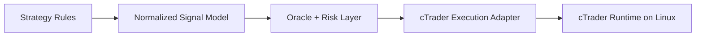

# cTrader Track

This folder represents the next-generation platform direction for Glitch Trading Core.

## Vision

Keep the trading concepts intact while replacing the MT5-specific execution layer with a cTrader-native architecture suitable for Linux deployment on GCP.

## Preserve

- strategy intent per bot
- Oracle conflict handling
- prop-firm risk controls
- shared feature engineering and labeling concepts
- session filters and regime routing

## Replace

- MT5 terminal connectivity
- MT5 account bootstrapping
- MT5 order lifecycle handling
- MT5 symbol metadata and point-value assumptions

## Target Design

## Migration Priorities

### 1. Pull strategy logic away from platform glue

Signal rules should become easier to reuse if we separate:

- indicator calculations
- signal generation
- risk constraints
- broker order placement

### 2. Port the best prop-oriented concepts first

Recommended first-wave concepts:

- Taipan session breakout
- Anaconda higher-timeframe breakout confirmation
- Hydra regime and risk routing

### 3. Keep schemas stable

Where possible, shared training fields and signal payloads should remain consistent so research can span both platforms.

## Outcome

The cTrader track is not a rewrite for the sake of rewriting.

It is the path to:

- Linux deployment
- cleaner architecture
- lower platform coupling
- easier prop-firm-oriented execution
