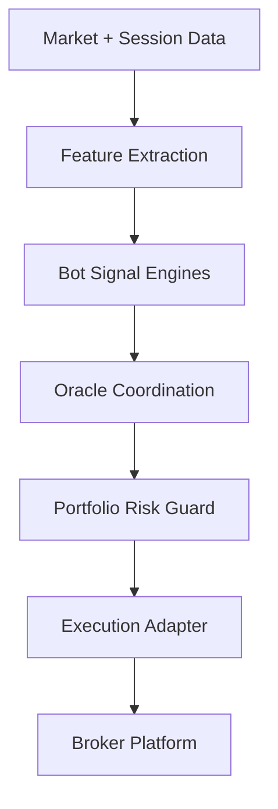

# Architecture

Glitch Trading Core is organized around a simple idea:

specialized bots generate opportunities, shared infrastructure standardizes data and risk, and the Oracle layer coordinates the final portfolio behavior.

## Core Layers

## Layer Responsibilities

### 1. Bot signal engines

Each bot is intentionally specialized:

- `Viper`: fast momentum and pullback continuation
- `Cobra`: price action around structure
- `Taipan`: session breakout logic
- `Mamba`: mean reversion in calmer regimes
- `Anaconda`: slower breakout validation
- `Hydra`: regime-aware tactical switching
- `Indian King Cobra`: a single unified bot whose momentum framework is segmented internally by timeframe role, asset profile, ML mode, and news-aware gating

### 2. Shared infrastructure

The shared modules in [`mt5/shared/`](../mt5/shared/) hold reusable logic for:

- indicators
- data collection
- strategy selection
- prop-firm guards
- portfolio-level exposure control
- risk sizing and logging

### 3. Oracle layer

The Oracle is the coordination brain of the ensemble. Its role is to:

- resolve conflicts between bots
- cap overlapping exposure
- shape total risk across symbols
- decide when independent signals should be treated as consensus

### 4. Execution adapter

Today, execution is MT5-oriented.

The long-term design target is to keep strategy and risk logic as platform-neutral as possible, then swap the execution adapter for cTrader.

## Design Priorities

- keep broker-specific code away from signal logic
- keep risk policy centralized
- keep feature engineering consistent across bots
- keep configs sanitized and portable

## What "Rich" Looks Like In This Repo

For this repository, a strong public presentation means:

- clear strategy taxonomy
- visible system architecture
- obvious platform migration path
- strong security posture for public GitHub
- documentation that makes the repo feel intentional, not accidental
